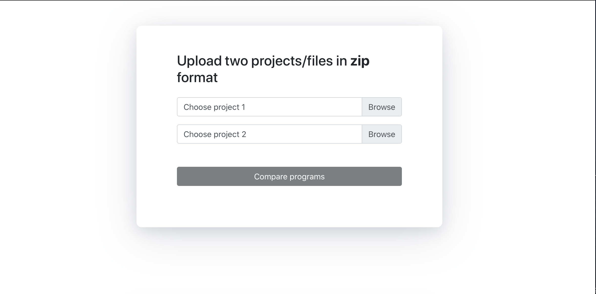
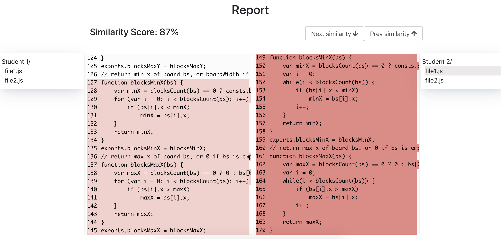

# Plagiarism Detector

A Plagiarism detector tool for JavaScript projects.
Allows upload of two zip folder of js projects/files for plagiarism comparison.

## Mock ups
Upload Page


Plagiarism Comparison Page



## Installing / Getting started

To get this running locally

Frontend
```shell
cd front-end
npm install
npm start
```
Npm will install all the required packages and npm start will run the start script


## Features
* Detects Plagiarised Code
* Highlights plagiarised code 
* Allows navigation between similarities across different files with next/prev buttons along with manual inspection


